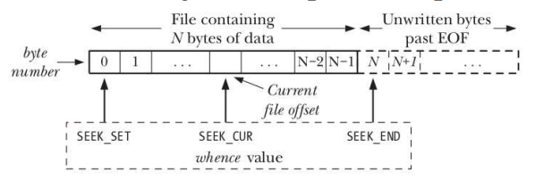

# linux-unix-system-programming

## Inotify

### Rather than writings lots of code before first compilation, use a frequent **edit-save-build** cycle to catch compiler errors early:

```shell
    while inotifywait -q . ; do clear; make; done
```

*`inotifywait is provided in the inotify-tools package`*

## System data types

> Examples of system data types


| Data type | POSIX type requirement | Description |
|-----------|------------------------|-------------|
| `uid_t` | Integer | User ID |
| `gid_t` | Integer | Groups ID |
| `pid_t` | Signed Integer | Process ID |
| `id_t` | Integer | Generic ID type; can hold pid_t, gid_t, uid_t|
| `off_t` | Signed Integer | File offset or size|
| `sigset_t` | Integer or Structu     re | Signal set |
| `size_t` | Unsigned Integer | Size of object (in bytes) |
| `ssize_t` | Signed Integer | Size of object or error indication |
| `time_t` | Integer/Real-floating | Time in seconds since Epoch |
| `timer_t` | Arithmetic type | POSIX timer ID |

> `(Arithmetic type == integer or floating type)`

## File descriptors (FD)

| FD | PORPOSE | POSIX name | stdio stream |
|----|---------|------------|--------------|
| `0` | Standard input | STDIN_FILENO | `stdin` |
| `1` | Standard output | STDOUT_FILENO | `stdout` |
| `2` | Standard error | STDERR_FILENO | `stderr` |

> are defined in <unistd.h>

 ## Key file I/O system calls

| fc | Description |
|----|---------|
| `open(const char \*pathname , int flags , mode_t mode)` | open a file, optionally creating it if needed. Returns file descriptor used by remaining calls |
| `read()` | input |
| `write()` | output |
| `close()` | close file descriptor |

### Open Flags

| Flag         | Description                                                                                           |
|--------------|-------------------------------------------------------------------------------------------------------|
| `O_RDONLY`   | Open the file for read-only access.                                                                   |
| `O_WRONLY`   | Open the file for write-only access.                                                                  |
| `O_RDWR`     | Open the file for both reading and writing.                                                           |
| `O_CLOEXEC`  | Set the close-on-exec flag for the file descriptor. This flag ensures that the file descriptor is automatically closed when executing a new program. |
| `O_CREAT`    | Create the file if it does not exist. Requires a third argument to specify the file mode (permissions). |
| `O_DIRECTORY`| Fail if the file is not a directory. This flag ensures that the `pathname` refers to a directory.       |
| `O_EXCL`     | Ensure that the call creates the file. If the file already exists, the call will fail. This flag requires `O_CREAT` to be set. |
| `O_NOCTTY`   | Do not make the file the controlling terminal for the process.                                        |
| `O_NOFOLLOW` | Do not follow symbolic links; if the `pathname` is a symbolic link, the open call will fail.            |
| `O_TMPFILE`  | Create a temporary file. The file will be created in the directory specified by `pathname` but will not be visible in the filesystem. Requires `O_DIRECTORY` to be set. |
| `O_TRUNC`    | Truncate the file to zero length if it already exists.                                                  |
| `O_APPEND`   | Append data to the end of the file.                                                                    |
| `O_ASYNC`    | Enable signal-driven I/O for the file descriptor. This flag allows asynchronous notifications for I/O operations. |

> `man open to more flags or details`

## lseek()

```c
#include <unistd.h>
off_t   lseek(int fd, off_t offset, int whence);
```

* Adjusts offset for open file referred to by fd
  * Some files types not seekable (pipes, sockets, etc)
* **offset** and **whence** determine new position
  * (**off_t** is an integer type)
* Returns new file offset (counted from start of file)
  
* **offset**: new offset (byte position);
* **whence**: how to interpret offset:
* * SEEK_SET: relative start of file;
* * SEEK_CUR: relative to current position;
* * SEEK_END: relative to next byte after EOF
* offset can be negative for SEEK_CUR and SEEK_END;

### examples

|||
|-|-|
| lseek(fd, 0, SEEK_SET) | start of file |
| lseek(fd, 1000, SEEK_SET) | byte 1000 |
| lseek(fd, 0, SEEK_END) | first byte past EOF |
| lseek(fd, -1, SEEK_END) | Last byte of file |



## File descriptor table

Per-process table with one entry for each FD opened by process:

* Flags controlling operation of FD (close-on-exec flag);
* Reference to open file descriptor;
* struct fdtable in include/linux/fdtable.h

## Table of open file descriptor (open file table)

System wide table, one entry for each open file on system:

* File offset;
* File access mode (R, W, R-W, from open());
* File status flags (from open());
* Reference to inode object for file;
* struct file in include/linux/fs.h

## (In-memory) inode table
System-wide table drawn from file inode information in filesystem:

* File type (Regular file, FIFO, socket, ...);
* File permissions;
* Other file properties (size, timestamps, ...);
* struct inode in include/linux/fs.h

## Duplicated file descriptors (intraprocess)

A process may have multiple FDs referring to same OFD

* Archieved using dup() or dup2()

## Duplicated file descriptors (between processes)

Two process may have FDs referring to same OFD

* Can occur as result of fork()

## Distinct open file table entries referring to same file

Two processes independently open()ed same file

### Why does this matter?

* Two different FDs referring to same OFD share file offset
* * (File offset == location for next read()/write())
* * Changes (read() | write() | lseek()) via one FD visible via other FD
* * Applies to both intraprocess & interprocess sharing of OFD
* Similar scope rules for stataus flags (O_APPEND, O_SYNC, ...)
* * Changes via one FD are visible via other FD
* * * (fcntl(F_SETFL) and fcntl(F_GETFL))
* Conversely, changes to FD flags (held in FD table) are private to each process and FD
* kcmp(2) KCMP_FILE operationn can be used to test if two FDs refer to same OFD
* * Linux-specific